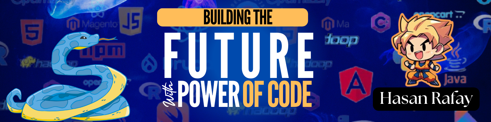

<h3 align="center">✨ Coding isn’t just work, it’s an art of solving problems. ✨</h3>

##  Hello, I'm Hasan Rafay!
I’m an 18-year-old aspiring AI Agentic Specialist with experience in Python, machine learning, and cloud computing. I focus on building scalable, intelligent AI solutions that adapt and evolve autonomously.

## 🔗 Connect with me:
     

# Tech Stack:
             

## 💛 Support:

  

## 📊 GitHub Stats:

## ⚡ Next Learning Focus:

  
  
  
  
  

    
        
  

 

